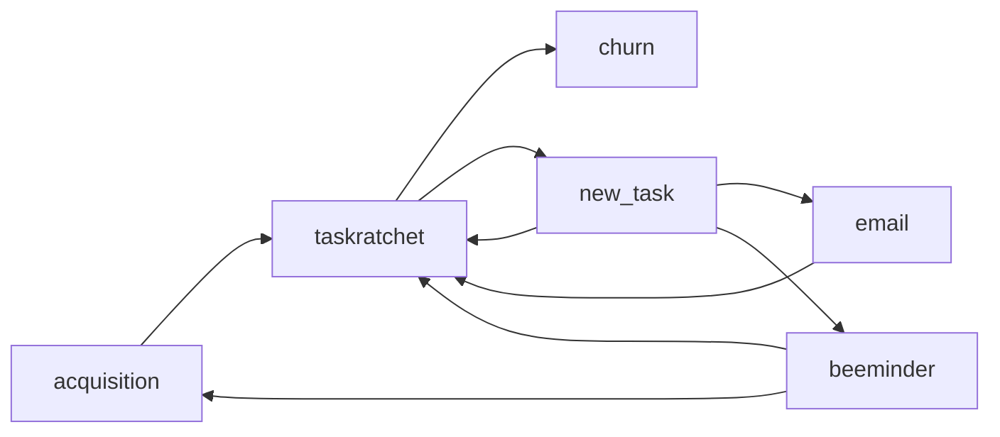

# Theory

## Index

- [Cohort Analysis](cohort-analysis.md)
- [Engine of Growth](engine-of-growth.md)

## Risks

- The addressable market is too small to fully support myself financially.
- I develop features that fail to provide value to users.

## Assumptions

- I can build a product that provides value to users.
- The addressable market is enough to support myself financially. To make $1,500 / month, I'd need 3000 new tasks to be created per month on average. This is 100 tasks per day.

## Data Upgrades

- [Cohort analysis](./cohort-analysis.md)
- Split testing
- User interviews
- Lost user surveys
- Tracking prodcut-market fit

## Questions

- How many users never create a task?
- What's my churn rate?
- What are my most effective acquisition channels?
- Why do users stop using TaskRatchet?
- What use cases do users use TaskRatchet to solve?
- What changes to TaskRatchet would create the most value for users?
